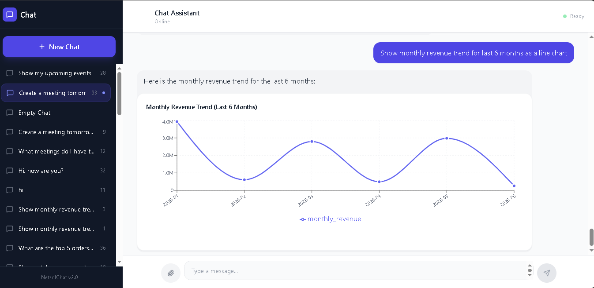
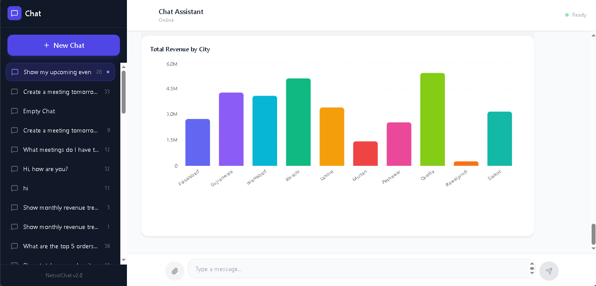
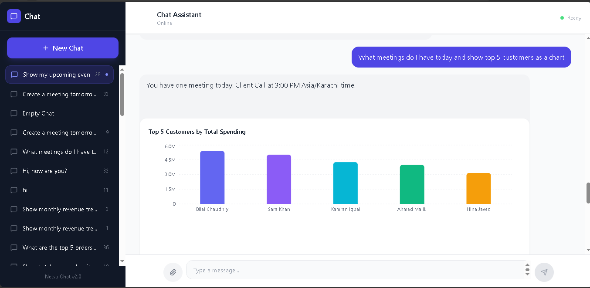

#  NetsolChatbot

<div align="center">

An intelligent, multi-tool AI assistant built for **NetsolTech** — powered by LangGraph, Google Gemini, and React.  
Supports RAG document Q&A, live web search, Google Calendar, natural language SQL queries, and interactive data visualizations.

[](https://www.python.org/)
[](https://fastapi.tiangolo.com/)
[](https://reactjs.org/)
[](https://langchain-ai.github.io/langgraph/)
[](https://deepmind.google/technologies/gemini/)
[](LICENSE)

</div>

---

## 📸 Screenshots

<table>
  <tr>
    <td align="center">
      
      <br/>
      <sub><b>📈 Natural language → SQL → Line Chart</b></sub>
    </td>
    <td align="center">
      
      <br/>
      <sub><b>📊 Revenue by City — Bar Chart</b></sub>
    </td>
  </tr>
  <tr>
    <td align="center" colspan="2">
      
      <br/>
      <sub><b>🔀 Multi-tool in one query — Calendar events + Top 5 customers chart</b></sub>
    </td>
  </tr>
</table>

---

## ✨ Features

| Feature | Description |
|---|---|
| 🧠 **LangGraph Agent** | Multi-step tool-calling agent with streaming responses |
| 📄 **RAG (Document Q&A)** | Upload PDF, DOCX, or TXT — ask questions from content |
| 📊 **Text-to-SQL + Charts** | Natural language → SQL → interactive bar, line, pie charts |
| 🌐 **Web Search** | Real-time search via Tavily API |
| 📅 **Google Calendar** | Check and create meetings via service account |
| 💬 **Chat History** | Persistent multi-thread conversations with sidebar |
| ⚡ **Streaming** | Real-time token-by-token response streaming |

---

## 🏗️ Architecture

```
User (React Frontend)
        │
        ▼
  FastAPI Backend
        │
        ▼
  LangGraph Graph
   ┌────┴────┐
   ▼         ▼
Retriever   LLM Node (Gemini)
(ChromaDB)      │
                ├── Tool: query_business_database → SQLite
                ├── Tool: web_search → Tavily API
                ├── Tool: get_upcoming_events → Google Calendar
                └── Tool: create_calendar_event → Google Calendar
```

**Request Flow:**
1. User message → FastAPI `/api/chat`
2. LangGraph `retriever_node` → similarity search in ChromaDB (top 10 chunks)
3. LangGraph `llm_node` → Gemini decides: answer from context OR call a tool
4. If tool called → `tools_node` executes → result back to LLM
5. Final response streamed chunk-by-chunk to frontend
6. Frontend parses `<chart_data>` tags → renders Recharts visualizations

---

## 🧰 Tech Stack

| Layer | Technology |
|---|---|
| **Backend** | Python 3.10+, FastAPI, Uvicorn |
| **AI / Agents** | LangGraph, LangChain, Google Gemini 2.5 Flash-Lite |
| **Embeddings** | Sentence-Transformers (`all-MiniLM-L6-v2`) |
| **Vector Store** | ChromaDB |
| **Database** | SQLite (chat history + business data) |
| **Frontend** | React 18, Vite, Tailwind CSS |
| **Charts** | Recharts |
| **Icons** | Lucide React |
| **Search** | Tavily Search API |
| **Calendar** | Google Calendar API (Service Account) |

---

## 📁 Project Structure

```
NetsolChatbot/
├── backend/
│   ├── main.py                    # FastAPI app + endpoints
│   ├── run.py                     # Uvicorn entry point
│   ├── src/
│   │   ├── graph.py               # LangGraph workflow
│   │   ├── state.py               # AgentState definition
│   │   ├── nodes/
│   │   │   ├── retriever.py       # ChromaDB similarity search
│   │   │   └── llm_responder.py   # Gemini LLM node
│   │   ├── rag/
│   │   │   ├── embeddings.py      # SentenceTransformer wrapper
│   │   │   ├── vector_store.py    # ChromaDB setup
│   │   │   └── document_loader.py # PDF/DOCX/TXT processing
│   │   ├── tools/
│   │   │   ├── calendar_tool.py   # Google Calendar tools
│   │   │   ├── search_tool.py     # Tavily web search
│   │   │   └── sql_tool.py        # Text-to-SQL tool
│   │   ├── models/
│   │   │   └── llm_factory.py     # Gemini client factory
│   │   ├── database.py            # SQLite chat history
│   │   └── utils/
│   │       └── helpers.py         # Title generation etc.
│   ├── scripts/
│   │   └── create_sample_db.py    # Sample business data seeder
│   ├── credentials/               # Google service account (gitignored)
│   ├── data/                      # SQLite DBs + ChromaDB (gitignored)
│   ├── .env                       # Environment variables (gitignored)
│   └── requirements.txt
├── frontend/
│   ├── src/
│   │   ├── components/
│   │   │   ├── chat/
│   │   │   │   ├── ChatWindow.jsx
│   │   │   │   ├── MessageList.jsx    # Chart tag parser + renderer
│   │   │   │   ├── MessageInput.jsx   # File upload + message send
│   │   │   │   ├── ChartMessage.jsx   # Recharts visualization
│   │   │   │   └── TypingIndicator.jsx
│   │   │   └── layout/
│   │   │       ├── ChatLayout.jsx
│   │   │       └── Sidebar.jsx
│   │   ├── context/
│   │   │   └── ChatContext.jsx        # Global state + streaming logic
│   │   └── services/
│   │       └── api.js                 # Backend API calls
│   └── package.json
├── docs/
│   └── screenshots/               # README screenshots
├── .gitignore
└── README.md
```

---

## ⚙️ Setup

### Prerequisites

- Python 3.10+
- Node.js 18+
- A Google Cloud project with:
  - Gemini API enabled → [Get API key](https://aistudio.google.com/apikey)
  - Google Calendar API enabled → [Service Account setup](https://console.cloud.google.com/iam-admin/serviceaccounts)
- Tavily API key → [Get free key](https://tavily.com) (1000 searches/month free)

---

### 1. Clone

```bash
git clone https://github.com/tashfeen786/NetsolChatbot.git
cd NetsolChatbot
```

---

### 2. Backend Setup

```bash
cd backend
python -m venv venv

# Windows
.\venv\Scripts\activate
# Linux/Mac
source venv/bin/activate

pip install -r requirements.txt
```

Create `backend/.env`:

```env
# Gemini
GOOGLE_API_KEY=your_gemini_api_key
MODEL_NAME=gemini-2.5-flash-lite

# Google Calendar (Service Account)
GOOGLE_SERVICE_ACCOUNT_FILE=credentials/your-service-account.json
GOOGLE_CALENDAR_ID=your_calendar_id@group.calendar.google.com

# Tavily Web Search
TAVILY_API_KEY=tvly-your_tavily_key

# Business Database
BUSINESS_DB_PATH=data/business.db
```

Place your Google Service Account JSON in `backend/credentials/`.

Seed the sample business database:

```bash
python scripts/create_sample_db.py
```

Start the backend:

```bash
python run.py
# API running at http://localhost:8000
# Docs at http://localhost:8000/docs
```

---

### 3. Frontend Setup

```bash
cd ../frontend
npm install
npm run dev
# App running at http://localhost:5173
```

---

## 🌐 API Reference

| Method | Endpoint | Description |
|---|---|---|
| `GET` | `/api/threads` | List all chat threads |
| `POST` | `/api/threads` | Create a new thread |
| `GET` | `/api/threads/{id}/messages` | Get messages for a thread |
| `POST` | `/api/chat` | Send message (streaming response) |
| `POST` | `/api/upload` | Upload PDF / DOCX / TXT file |

---

## 💡 Usage Examples

**Document Q&A**
```
Click 📎 → upload a PDF → ask:
"Summarize the key points from the uploaded document"
```

**Business Data + Chart**
```
"Show total revenue by city as a bar chart"
"Which account manager has the highest sales?"
"Show monthly revenue trend for the last 6 months as a line chart"
```

**Calendar**
```
"What meetings do I have today?"
"Schedule a team sync tomorrow at 3 PM to 4 PM"
```

**Web Search**
```
"What is the current USD to PKR exchange rate?"
"Search for latest news about NetsolTech"
```

**Multi-tool (one query, two tools)**
```
"What meetings do I have today and show top 5 customers as a chart"
```

---

## 🔐 Security Notes

- `.env` files and `credentials/` are excluded from version control via `.gitignore`
- SQL tool only allows `SELECT` queries — `DROP`, `DELETE`, `INSERT`, `UPDATE` and other destructive keywords are blocked
- File uploads are validated by extension and size (max 10MB)
- API keys are never exposed in source code or frontend bundles

---

## 🛠️ Troubleshooting

| Issue | Fix |
|---|---|
| Server crashes silently on first request | Ensure `os.environ["KMP_DUPLICATE_LIB_OK"] = "TRUE"` is the first line in `run.py` |
| `503 UNAVAILABLE` from Gemini | API rate limit — wait a few seconds and retry |
| Calendar returns no events | Verify service account email is shared on the calendar with "Make changes to events" permission |
| Chart not rendering | Check browser console for `<chart_data>` parse errors; ensure `recharts` is installed |
| File upload fails | Check file is PDF/DOCX/TXT and under 10MB |

---

## 🚀 Deployment

**Backend** — [Railway](https://railway.app) or [Render](https://render.com)
- Set all `.env` variables in the platform dashboard
- Set start command: `python run.py`

**Frontend** — [Vercel](https://vercel.com) or [Netlify](https://netlify.com)
- Set `VITE_API_URL=https://your-backend-url.com`
- Build command: `npm run build`

---

## 🤝 Contributing

1. Fork the repository
2. Create a feature branch: `git checkout -b feature/your-feature`
3. Commit: `git commit -m "Add your feature"`
4. Push: `git push origin feature/your-feature`
5. Open a Pull Request

---

## 📄 License

This project is licensed under the [MIT License](LICENSE).

---

## 👤 Author

**Tashfeen**  
GitHub: [@tashfeen786](https://github.com/tashfeen786)  
Project: [NetsolChatbot](https://github.com/tashfeen786/NetsolChatbot)

---

<div align="center">
Built with ❤️ using LangGraph · Gemini · React
</div>
